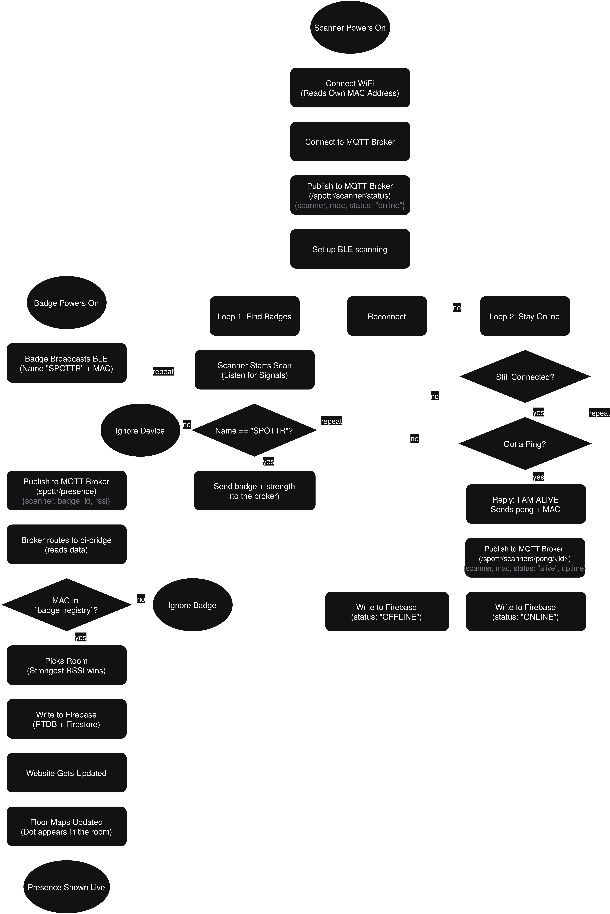

# SPOTTR: Real-time BLE Presence Tracking using ESP32
SPOTTR is an open-source indoor presence tracking system built on ESP32-C3 and Bluetooth Low Energy. Wear a Badge, walk into a room, show up on a map

## Features
 -  **BLE Beacon Badges**: ESP32-C3 Powered badges that broadcast unique identifiers.
 - **Room Level Detection** : Fixed scanner nodes placed in rooms to detect nearby badges.
 - **Real-time Mapping**: Visualize presence on a web-based map.
 - **Open Source**: Fully open-source hardware and software.

## Hardware Components
- **ESP32-C3**: Low-power microcontroller with integrated BLE.
- **Battery**: For portable badge operation.
- **Enclosure**: 3D printed or custom case for the badge.
- **Scanner Nodes**: ESP32-C6 based devices placed in rooms to detect badges.

## Software Components
- **Firmware**: Custom firmware for badges and scanner nodes to handle BLE communication and data processing.
- **Backend Server**: Python Server running locally on a Raspberry Pi to collect data from scanner nodes and send off to database
- **Web Interface**: React-based web application to visualize presence data on a map.
- **Database**: Firebase Realtime Database for storing presence data.

---
## Renders


---
## Flow Chart


---
## Getting Started
Spottr has four parts to set up: **Badges, Scanners, Pi Bridge**, and **Web Dashboard**. You'll need atleast one badge (ESP32-C3) and one scanner (ESP32-C6) to start with.

### Prerequisites
- **ESP32-C3** modules for badges
- **ESP32-C6** modules for scanners
- **Raspberry Pi** (or any always-on Linux machine) for broker + bridge
- [PlatformIO](https://platformio.org/) (only if you are building firmware from source)

### 1. Flash the firmware
**Method 1:**  grab the prebuilt `.bin` files from the [latest release](../../releases) and flash them with the [ESP Web Flasher](https://espressif.github.io/esptool-js/) (no install needed)
 - Flash `spottr-badge-merged.bin` to each ESP32-C3 at offset `0x0` (Coming Soon)
 - Flash `spottr-scanner-merged.bin` to each ESP32-C6 at offset `0x0` (Coming Soon)

**Method 2:** clone the repo and build the firmware yourself using PlatformIO
```bash
#badge
cd backend/firmware/badge/spottr-badge
pio run -t upload
```

```bash
#scanner
cd backend/firmware/scanner/spottr-scanner
pio run -t upload
```

### 2. Set up the Pi Bridge
1. Install the Mosquitto MQTT broker on any server:
```bash
sudo apt update
sudo apt install mosquitto mosquitto-clients
sudo systemctl enable mosquitto
```
2. Set up the Python Bridge:
```bash
cd backend/pi-bridge
pip install -r requirements.txt
```
3. Create a `.env` file in `pi-bridge/` with the following variables:
```
FIREBASE_DB_URL='<RTDB URL>'
SERVICE_ACCOUNT='<PATH TO SERVICE ACCOUNT JSON FILE>'
```
4. Drop your Firebase Admin `serviceAccount.json` in the folder, then run:

```bash
python main.py
```

### 3. Run the Web Dashboard
```bash
cd frontend/website
npm install
npm run dev
```
Add your Firebase config to `.env` file. Check `.env.example` for reference.

---
 ## Roadmap

### Phase 1 — Website & Dashboard UI
- [x] Project scaffold and structure
- [x] Landing page with 3D badge model
- [x] Intro animation and hero section
- [x] Navbar
- [ ] Footer
- [ ] How it works section
- [ ] Hardware section
- [ ] Software section

### Phase 2 — Badge Firmware
- [x] ESP32-C3 BLE beacon setup
- [ ] Soldering ESP32-C3 modules with Battery
- [ ] Deep sleep between broadcasts (30s interval)
- [ ] 9 month battery life optimization

### Phase 3 — Scanner Firmware
- [x] ESP32-C6 BLE scan
- [x] RSSI reading per badge
- [x] WiFi MQTT publish to Pi broker
- [x] Scanner Status heartbeat
- [ ] Offline buffering if WiFi drops

### Phase 4 — Pi Bridge
- [x] Mosquitto MQTT broker setup on Pi
- [x] Python bridge — MQTT subscriber
- [x] Receive RSSI data from scanner nodes
- [x] Check scanner online/offline status
- [x] Heartbeat monitor per scanner
- [x] Pass location data to Database
- [x] Basic nearest room logic (strongest RSSI wins)
- [ ] Offline retry if Database unreachable

### Phase 5 — Admin Dashboard
- [x] Floor map with badge dots
- [x] Room occupancy counts
- [x] Badge management (add, edit, remove)
- [ ] Scanner node status (online/offline)
- [ ] Attendance log table with timestamps
- [ ] Export attendance as CSV

### Phase 6 — Access Control
- [ ] Zone definitions (restricted, public, admin)
- [ ] Badge permission levels
- [ ] Alert on unauthorized zone entry
- [ ] Door event logging via NFC tap
- [ ] Access history per badge
- [ ] Admin override and manual unlock

### Phase 7 — Mobile App
- [ ] React Native scaffold
- [ ] Personal tracker view 
- [ ] Movement history for the day
- [ ] Push notifications for zone alerts

---

## License
MIT License © 2026 Prathamesh Prabhakar

---
**Note: Spottr is currently under active development. Stay tuned.**