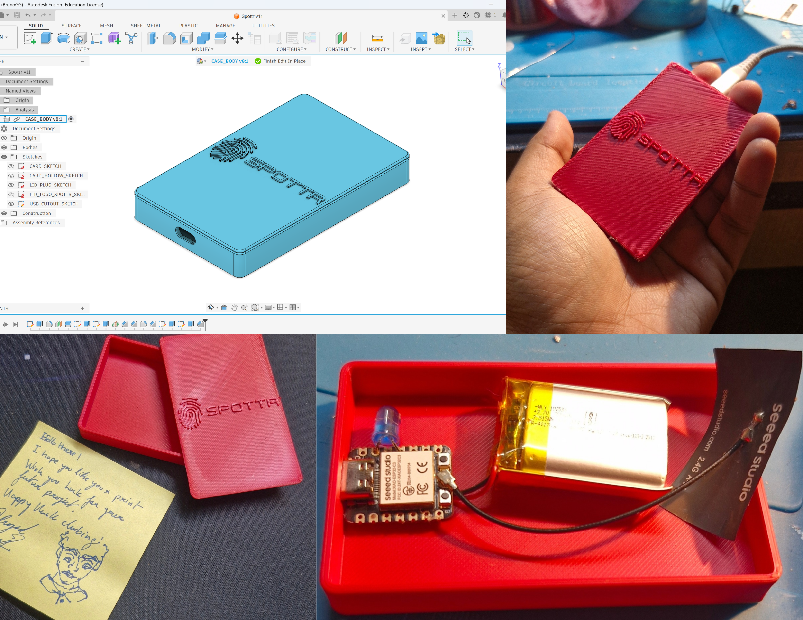
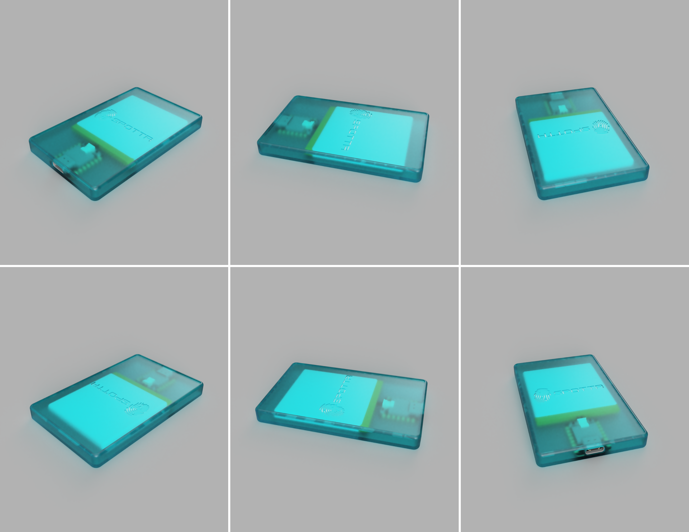
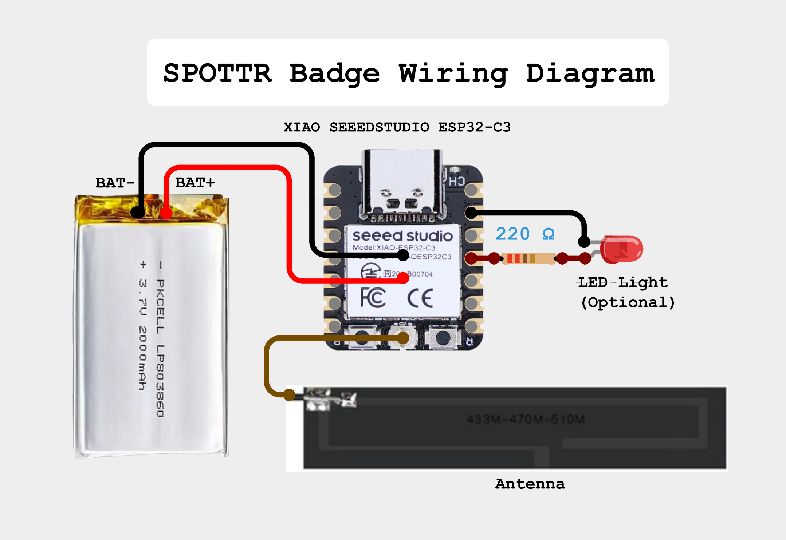
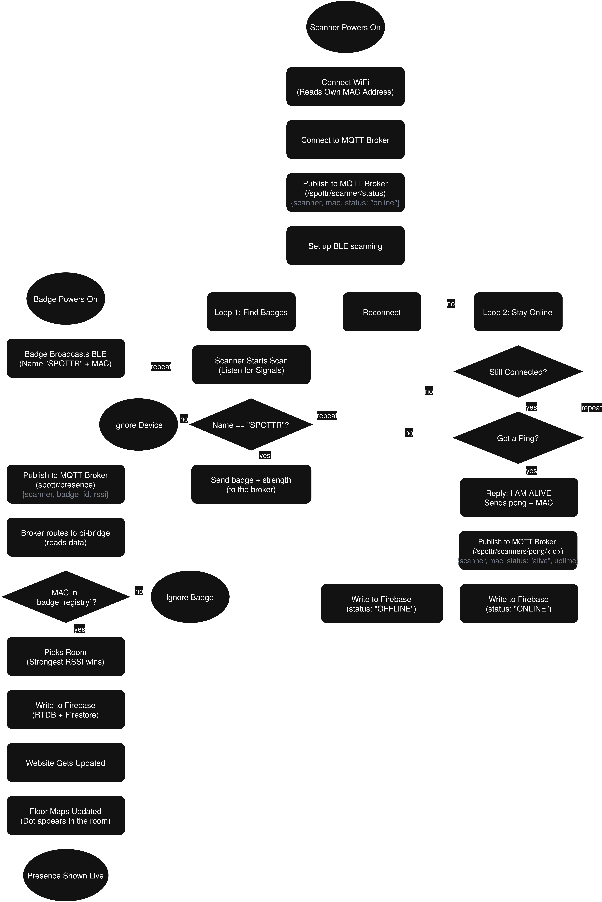

# SPOTTR: Real-time BLE Presence Tracking using ESP32
SPOTTR is an open-source indoor presence tracking system built on a cheap aah microcontroller (ESP32-C3 & ESP32-C6) and Bluetooth Low Energy. This project has multiple applications as it can be used in schools, offices, warehouses or even hospitals.

## Features
 -  **Wearable BLE Badges**: ESP32-C3 Powered badges that broadcast BLE signals at a particular period of time.
 - **Room Level Detection** : Fixed scanner nodes placed in every room to detect the badges and publish the recieved values via MQTT.
 - **Spottr-Bridge** : This is a server that sits between the scanner-nodes and the cloud as data from the nodes first reaches this server via MQTT and then passed on to the cloud. Did this to reduce load on each scanner if they started publishing data individually.

## Hardware Components Used
- **ESP32-C3**: A Low-power microcontroller which also has BLE support. This is used inside the badges
- **LiPo Battery**: To power the badge.
- **ESP32-C6**: Used in the scanner-nodes to recieve data from ESP32-C3 badges.

---
## Renders

---

## Wiring Diagram

---

## Flow Chart

---

## Setup Guide:
Checkout the [Setup File](SETUP_PROJECT.md)

## License
AGPL-3.0 © 2026 Prathamesh Prabhakar

---
**Note: Spottr is currently under active development. Stay tuned.**
